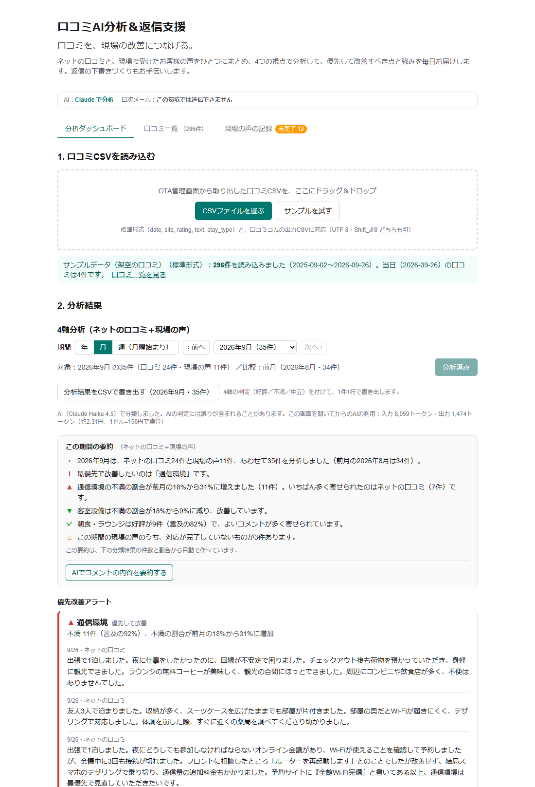
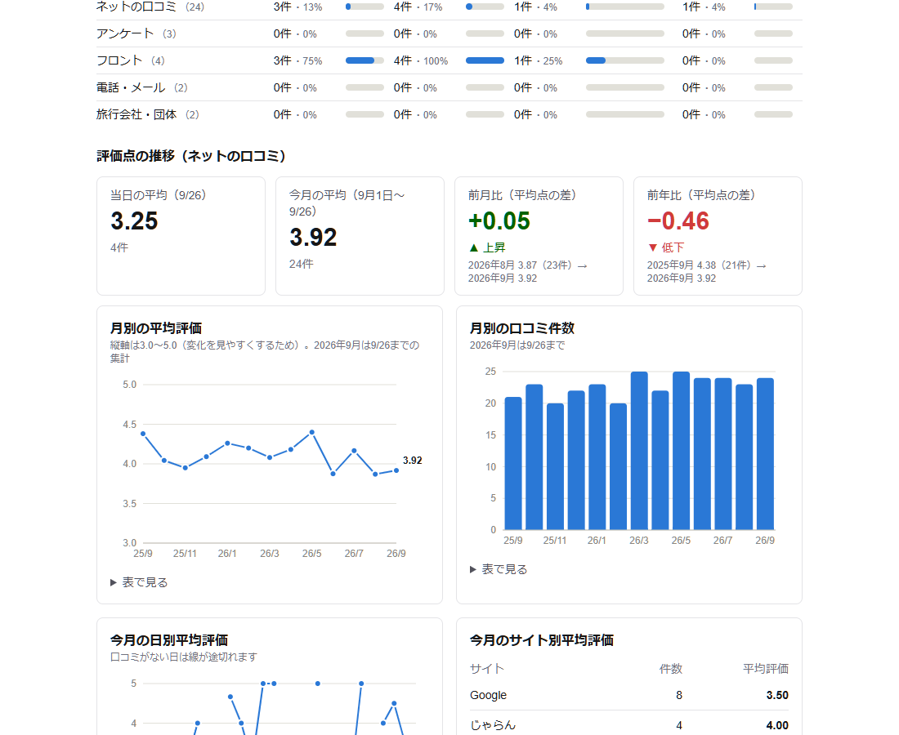
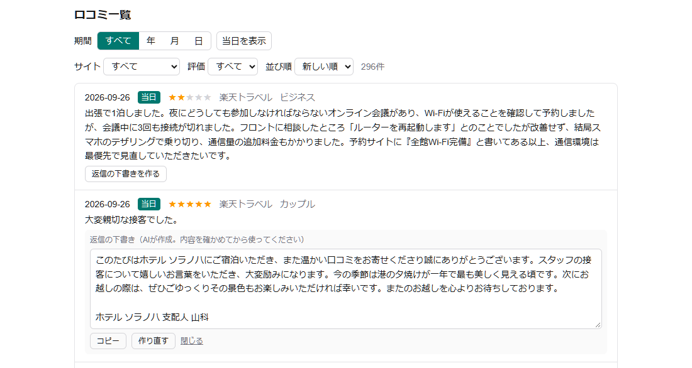

# 口コミAI分析＆返信支援

**口コミを、現場の改善につなげる。**

- 公開URL：https://hotel-review-ai.vercel.app/
- 侍テラコヤ課題「設計から開発・公開までを自分の力でやり遂げよう」の提出物です



## 概要

ホテル・旅館向けに、ネットの口コミ（OTA・Google）と、現場で受けたお客様の声（アンケート・フロント・電話/メール・旅行会社/団体）を1つにまとめ、同じ4つの視点（客室設備／通信環境／接客・ホスピタリティ／朝食・ラウンジ）で分析する Web アプリです。優先して改善すべき点と強みを毎日スタッフに届け、返信の下書きづくりも手伝います。

### 解決したい課題

- 現場スタッフは口コミを見ても「返信文をどう書くか」に意識が向き、口コミを業務改善に結び付けられていない
- 「大変親切な接客でした」のような一言の好評口コミへの返信に迷い、時間を取られている
- ネットの口コミと現場で受けた声が別々に管理され、同じ不満が両方に出ていても気づきにくい

コンセプトは **「返信に悩む時間を、改善と接客に戻す」**。アプリの主役は分析で、返信の下書きは分析に時間を回すための補助機能です。

### アプリでできること

- 口コミCSVと現場の声を、4つの視点で分類してまとめて分析する（AI：Claude）
- 年・月・週から期間を選び、1つ前の期間と「不満の割合」で比べて、改善・悪化を見る
- 優先改善アラートと、よいコメントを全文で確認する
- 評価点の推移（当日・今月・前月比・前年比）を見る
- 現場で受けた声を記録し、対応状況を管理する
- 当日の口コミと現場の声、月の要約を、日次メールで現場スタッフに送る
- 口コミへの返信の下書きを作る

## 主な機能

| 機能 | 内容 |
|---|---|
| 口コミCSVの読み込み | 標準形式と、口コミコムの出力CSVに対応（列名から自動判断・UTF-8／Shift_JIS）。外国語の口コミは日本語訳で分析し、原文も残す |
| 4軸分析 | 客室設備／通信環境／接客・ホスピタリティ／朝食・ラウンジ の4軸で、口コミと現場の声を Claude で分類 |
| 期間の比較 | 年・月・週（月曜始まり）を選び、1つ前の期間と「不満の割合」で比べて改善・悪化を表示 |
| 優先改善アラート／よいコメント | 不満が多い軸・増えた軸をアラートにし、該当するコメントを全文表示。好評のコメントも全文表示 |
| 経路別の不満の傾向 | ネットの口コミ・アンケート・フロント・電話/メール・旅行会社/団体 ごとに比較 |
| 要約 | 件数・割合はアプリが計算して文章にし、AIには「不満の内容」「好評の内容」だけを書かせる（事実と違う数字を書かせないため） |
| 評価点の推移 | 当日・今月の平均、前月比、前年比、月別・日別のグラフ（AIを使わずコードで集計） |
| 現場の声の記録 | 受付日・経路・お客様の区分・内容・評価・対応状況・対応内容を入力。ブラウザに自動保存し、CSVで書き出し・読み込み |
| 日次メール | 当日の口コミと現場の声、今月の要約、評価点を Resend で送信（外資系ホテル向けに項目名は英語、文章は日本語） |
| 分析結果のCSV書き出し | 4軸の判定を付けて、1件1行で書き出し |
| 返信の下書き | 口コミ1件ごとに、口コミと同じ言語で下書きを1案作成。画面で直してコピーして使う |





## 使い方

### まず試す（サンプルCSVで）

1. 公開URL https://hotel-review-ai.vercel.app/ を開く
2. 「分析ダッシュボード」の「**サンプルを試す**」を押す（架空のホテルの口コミ296件・13か月分が読み込まれます）
3. 「**分析する**」を押すと（AI機能のため、パスコードが必要です。下記）、4つの視点の分析結果（要点カード・優先改善アラート・よいコメント・経路別の比較）が表示されます。期間（年・月・週）も切り替えられます
4. 「現場の声の記録」タブの「サンプルを追加」で、架空の現場の声を加えると、ネットの口コミと合わせた分析になります
5. 「口コミ一覧」タブで、口コミごとに「返信の下書きを作る」を押すと下書きが作れます（こちらもパスコードが必要です）

サンプルCSVは [public/sample/reviews_sample.csv](public/sample/reviews_sample.csv)、現場の声のサンプルは [public/sample/voices_sample.csv](public/sample/voices_sample.csv) です。自分のCSVを使うときは「CSVファイルを選ぶ」から読み込みます（標準形式と口コミコムの出力に対応）。

### AI機能・メール送信にはパスコードが必要です

公開版では、AIの分析・要約・返信の下書き・メール送信は、費用がかかるため**デモ用パスコード**が必要です（画面の上部に入力欄が出ます）。パスコードは提出時にお伝えします（このREADMEには書きません）。

- パスコードがなくても、画面の操作、口コミ一覧、評価点のグラフ、現場の声の記録は使えます
- 1日の利用回数にも上限があります（分類2,000件・要約30回・メール10回・返信100回）
- 環境変数でパスコードを設定していない環境（手元で動かすときなど）では、パスコードは求められません

### 毎日の運用（想定）

1. 現場で受けた声は、その日のうちに「現場の声の記録」に入力する
2. 夕方、OTA管理画面から取り出した口コミCSVを読み込む
3. 「分析する」を押し、優先改善アラートとよいコメントを確認する
4. 「メール送信」で、現場スタッフに日次メールを送る
5. 返信が必要な口コミは、「口コミ一覧」で下書きを作って直し、各サイトに貼り付ける

## データについて

- **口コミ・現場の声は、すべて架空のデータです。** 実在の口コミは使っていません（施設「ホテル ソラノハ」も架空です）
- **実運用では、オーナーが自館のデータ（OTA管理画面などから取り出したCSV）を持ち込む設計です。** アプリは渡されたCSVを分析するだけで、OTAのサイトの**スクレイピング（自動収集）は行いません**
- 現場の声には、お客様の氏名・電話番号・部屋番号の欄を作っていません。内容にも書かないよう、画面で注意を出します
- 口コミはデータベースに保存しません。現場の声は、使っているブラウザ内（localStorage）に保存し、CSVで書き出し・読み込みができます

## 技術構成

| 分類 | 使用技術 |
|---|---|
| フレームワーク | Next.js 16（App Router）・TypeScript・React 19 |
| 見た目 | Tailwind CSS 4・Recharts（グラフ） |
| AI | Claude API（Anthropic TypeScript SDK）。分類は Structured Outputs（決めたJSONの形）で受け取る |
| メール | Resend |
| CSV | Papa Parse |
| 公開 | Vercel（GitHub に push すると自動で再公開） |

- Claude API はサーバー側（API Routes）からだけ呼び出し、APIキーをブラウザに出さない
- データベースは使わない。口コミはCSVを読み込むたびに画面で扱い、現場の声はブラウザ（localStorage）に保存する

### AIモデルと費用

| 用途 | モデル | 実測した費用 |
|---|---|---|
| 4軸分類・要約 | Claude Haiku 4.5 | 分類 約0.036円／件、要約 約1.2円／回。1施設1か月 約111円（分類結果を使い回せば約38円） |
| 返信の下書き | Claude Sonnet 5 | 約0.69円／件（Haiku 4.5 は約0.35円。10件で比べ、より自然な Sonnet 5 を採用） |

モデル名はコードに書かず、環境変数で切り替えます。

## セキュリティと安全への配慮

- APIキーは環境変数で管理し、リポジトリに含めない
- 費用がかかる操作（AIでの分類・要約・返信下書き、メール送信）は、デモ用パスコードと1日の利用回数の上限で守る
- メールの送り先はサーバーの設定で固定し、画面から指定できないようにする
- 口コミ・現場の声の本文はお客様の文章として扱い、AIが中の指示に従わないようにプロンプトで指定する。メールに載せるときはエスケープする
- CSV書き出しでは、Excelで数式として動かないよう先頭の記号を無害化する
- 現場の声には氏名・電話番号・部屋番号の欄を作らず、本文に書かれていそうなときは注意を出す
- OTAのサイトを自動で収集する機能は作らない（データを取りに行くのはオーナー、アプリは渡されたCSVを分析するだけ）

## 手元で動かす

```bash
npm install
npm run dev
```

http://localhost:3000 を開きます。環境変数を何も設定しなければ、AIを呼ばないダミーの分類で動きます（費用0）。

本物のAIやメールを使うときは、`.env.local` に次の値を書きます（このファイルは GitHub に上げません）。

| 環境変数 | 内容 |
|---|---|
| `ANTHROPIC_API_KEY` | Claude API のキー |
| `USE_MOCK_AI` | `false` にすると本物のAIを使う（それ以外はダミー） |
| `CLAUDE_MODEL_CLASSIFY` | 分類・要約のモデル（例：`claude-haiku-4-5`） |
| `CLAUDE_MODEL_REPLY` | 返信下書きのモデル（例：`claude-sonnet-5`） |
| `RESEND_API_KEY` / `MAIL_TO` / `MAIL_FROM` | 日次メールの送信設定 |
| `DEMO_PASSCODE` | 設定すると、費用がかかる操作にパスコードが必要になる |
| `DAILY_LIMIT_CLASSIFY_ITEMS` など | 1日の上限（分類2000件・要約30回・メール10回・返信100回が初期値） |

## 効果測定

`scripts/` の測定用スクリプトで測ります。使い方は [data/eval/README.md](data/eval/README.md) にあります。

- APIコスト：測定済み（上の表）
- 返信下書きの Haiku 4.5／Sonnet 5 の比較：測定済み（[結果](data/eval/results/replies-compare-2026-09-30.md)）
- 分類の精度（判断が難しい例を中心にした20件で、人の判定との一致率）：測定予定
- 返信作成時間（1件5〜7分 → 目標1分）：測定予定

## 今後の展開

今回は、期限内に「読み込み → 分析 → 共有」を確実に動かすため、範囲を絞りました。次のことを予定しています。

- **現場の声の共有**：データベースとログインを導入し、複数のスタッフが同じデータを見られるようにする（複数施設の管理・料金プランも）
- **口コミの統合をさらに進める**：CSVにできないサイトの口コミを画面からコピペで取り込む。サイトをまたいだ重複を除く
- **返信の下書きの強化**：口調（格式高い／親しみやすい）と、返信の目的（お詫び＋再発防止／リピート誘致）を選べるようにする
- **連携**：OTA・Google との API 連携（オーナーが許可した方法で）
- **夜勤の引継ぎ機能**：故障部屋・VIP客・重要クレームの対処経過などを共有する
- **ライバル施設の料金比較**
- **効果測定の続き**：分類の精度（人の判定との一致率）と、返信作成時間の実測
